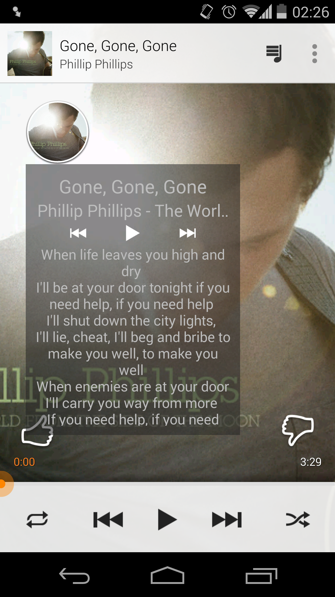
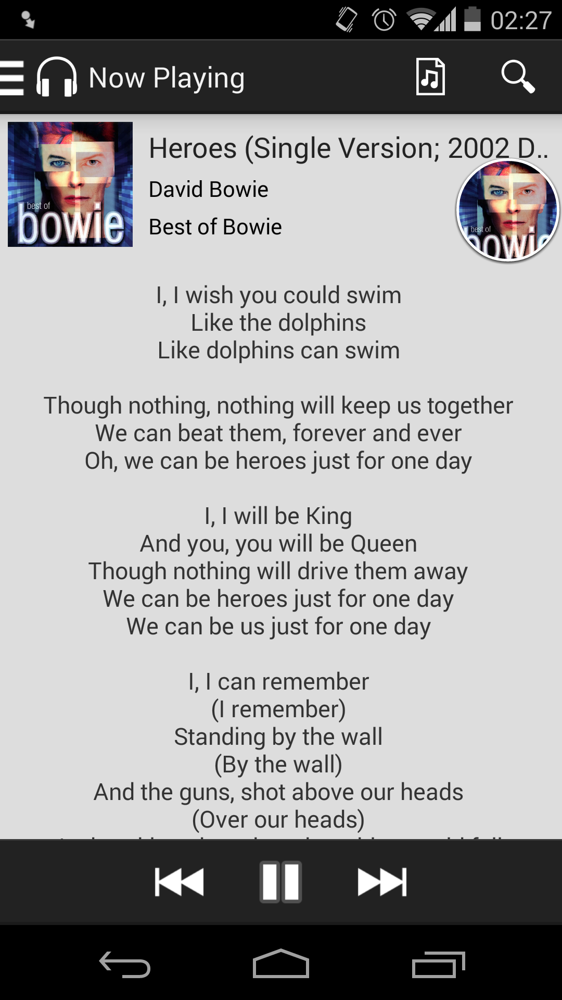
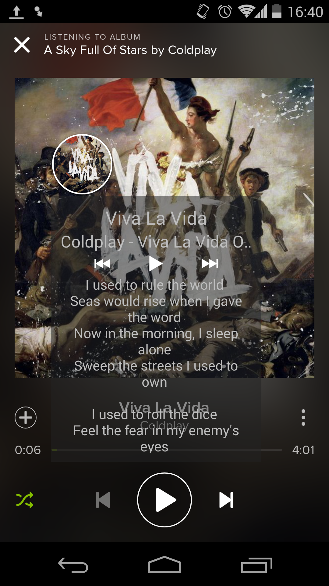

LyricsHead
==========

An Android app that lets you control your music player and view the lyrics of you favorite songs as you listen to them. LyricsHead uses LyricFind's lyrics service to pull the lyrics of the track you are currently playing. Inspired by Facebook Messenger's Chat Heads, you can use LyricsHead even while on other apps.

LyricsHead was developed as a project for Mike Scott's Mobile Computing class at UT Austin during the fall semester of 
2014. The people at LyricFind were kind enough to provide me with a research license to use their service during the
development of the app, unfortunately, that license is not valid anymore so I cannot upload the code right now. I will
as soon as I remove all references to their service. For now all we have is screenshots from its glory days.

NOTE: After removing the lyrics functionality, the app will be mostly useless :( so I'll probably end up releasing the 
LyricsHead functionality as a library or a demo project as I found it difficult to find resources on how to create something similar to Facebook's Chat Heads and the documentation on Facebook Rebound is not very detailed.
